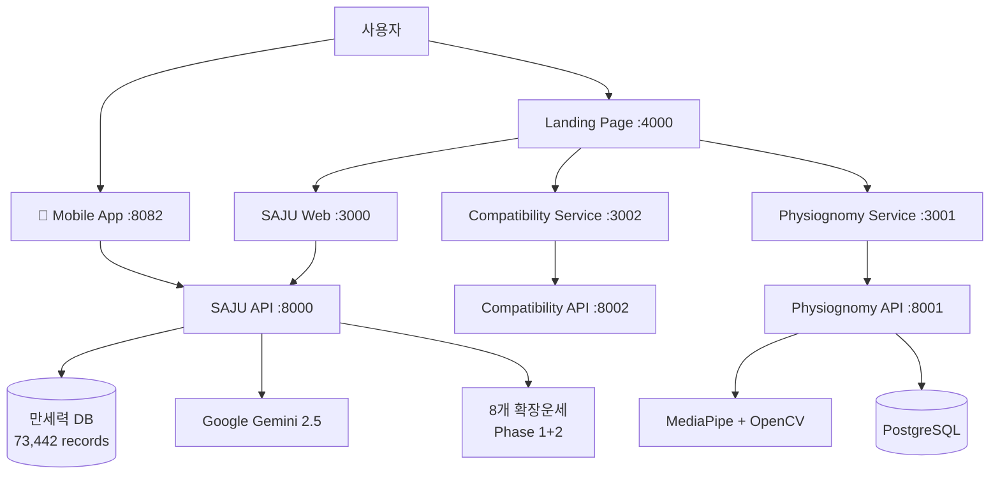

# 📋 MSProject2 SAJU - 프로젝트 개요

> **전통 명리학 + 현대 AI 기술 융합 플랫폼**  
> **완성일**: 2025-08-05 | **완성도**: 100%

---

## 🎯 프로젝트 비전

**"대한민국 최고 수준의 온라인 사주 분석 서비스"**

전통 명리학을 현대 AI 기술과 융합하여 누구나 쉽게 접근할 수 있는 **완전 분리형 마이크로서비스** 플랫폼을 구축

---

## 🏗️ 시스템 아키텍처

### 마이크로서비스 구조

### 서비스별 역할

| 서비스 | 포트 | 기능 | 기술 스택 | 상태 |
|--------|------|------|-----------|------|
| **Main Landing** | 4000 | 통합 허브, 4가지 테마 | HTML + CSS + Python | ✅ 완성 |
| **SAJU Service** | 3000/8000 | 사주팔자 분석 37개 메서드 | FastAPI + React | ✅ 완성 |
| **Mobile App** | 8082 | 크로스플랫폼 모바일 | React Native + Expo | ⚠️ 95% |
| **Compatibility** | 3002/8002 | 궁합 분석 | FastAPI + React | ✅ 완성 |
| **Physiognomy** | 3001/8001 | AI 관상 분석 | Docker + MediaPipe | ✅ 완성 |

---

## 📊 핵심 성과 지표

### 🏆 기술적 성취

- **5개 서비스** 완전 구현 (웹 4개 + 모바일 1개)
- **73,442개 만세력 데이터** 구축 (1900-2100년)
- **37개 사주 분석 메서드 + 8개 확장운세** 완성
- **마이크로서비스 아키텍처** 완전 구현
- **크로스플랫폼 개발** (웹 + iOS/Android)

### 💡 혁신적 특징

- **전통 명리학 디지털화**: 73,442개 만세력 DB + 37개 분석 알고리즘
- **AI 기술 융합**: Google Gemini 2.5-flash, MediaPipe, OpenCV
- **확장 가능한 구조**: 독립적 서비스, Docker 컨테이너화
- **현대적 UX**: 4가지 테마, 반응형 디자인, 실시간 분석

### 📈 비즈니스 가치

- **시장 차별화**: 대한민국 최고 수준 플랫폼
- **확장성**: 마이크로서비스로 무한 확장 가능
- **상용화 준비**: 완전한 웹 서비스 형태
- **멀티플랫폼**: 웹/모바일 동시 지원

---

## 🔧 기술 스택 상세

### 백엔드
- **프레임워크**: FastAPI + Pydantic
- **데이터베이스**: SQLite (SAJU), PostgreSQL (Physiognomy)
- **AI 모델**: Google Gemini 2.5-flash, MediaPipe, OpenCV
- **벡터 DB**: FAISS (관상학 RAG)
- **배포**: Uvicorn, Docker Compose

### 프론트엔드
- **프레임워크**: React 18 + TypeScript
- **모바일**: React Native + Expo
- **스타일링**: styled-components
- **빌드**: Create React App, Webpack, Vite

### 데이터 & AI
- **만세력**: 73,442개 레코드 (고영창님 "진짜 만세력" 기반)
- **AI 해석**: Google Gemini 2.5-flash 대화형 시스템
- **관상 분석**: MediaPipe 468개 랜드마크 + OpenCV
- **벡터 검색**: FAISS 기반 RAG 시스템

---

## 🎊 프로젝트 완성도

### ✅ 100% 완성 서비스

1. **SAJU Service**: 37개 분석 메서드, AI 대화, 대운/세운
2. **Compatibility Service**: 오행상성 + 십성매칭 궁합 분석
3. **Physiognomy Service**: AI 관상 분석, Docker 배포
4. **Landing Page**: 4가지 테마, 서비스 통합 허브

### ⚠️ 95% 완성 서비스

1. **Mobile App**: 모든 기능 구현, 네트워크 연결 이슈 해결 중

---

## 🚀 향후 발전 방향

### Phase 1: 완성도 향상
- 모바일 앱 네트워크 연결 완전 해결
- 성능 최적화 및 안정성 강화

### Phase 2: 기능 확장
- AI 기반 예상 질문 제안 시스템
- 실시간 알림 및 소셜 기능
- 프리미엄 서비스 확장

### Phase 3: 상용화
- 사용자 관리 시스템
- 결제 시스템 연동
- 마케팅 및 사업화

---

**🏆 "전통과 현대 기술의 완벽한 융합으로 새로운 가치를 창조한 프로젝트"**