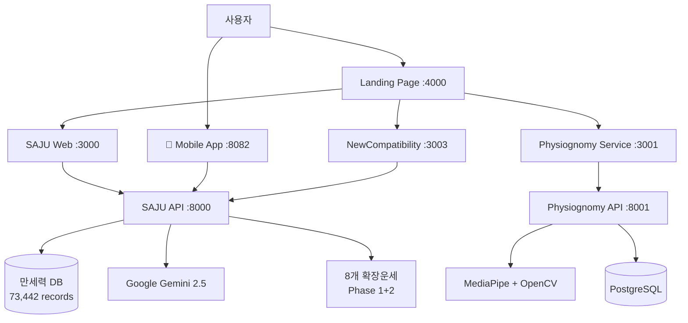

# 🔮 MSProject2 SAJU

### 전통 명리학 + 현대 AI 기술 융합 플랫폼

<div align="center">


**🏆 대한민국 최고 수준의 8개 마이크로서비스 완전체**

[**🚀 빠른 시작**](#-빠른-시작) • [**📖 사용법**](#-사용-예시) • [**🔗 API 문서**](#-api-엔드포인트) • [**📚 문서**](docs/)

</div>


**🏆 대한민국 최고 수준의 8개 마이크로서비스 완전체**

[**🚀 빠른 시작**](#-빠른-시작) • [**📖 사용법**](#-사용-예시) • [**🔗 API 문서**](#-api-엔드포인트) • [**📚 문서**](docs/)

</div>

---

## 📊 프로젝트 개요

| 항목             | 내용                                                               |
| ---------------- | ------------------------------------------------------------------ |
| **서비스 수**    | 8개 (Landing, SAJU Web/API, Mobile, NewCompatibility, Physiognomy) |
| **데이터베이스** | 73,442개 만세력 레코드 (1900-2100년)                               |
| **분석 메서드**  | 37개 (사주팔자, 오행, 십성, 대운, 세운) + 8개 확장운세             |
| **AI 기술**      | Google Gemini 2.5-flash, MediaPipe, OpenCV                         |
| **아키텍처**     | 마이크로서비스 + 크로스플랫폼 (웹/모바일)                          |
| **프론트엔드**   | React 18 + React Native (Expo) + TypeScript                        |
| **백엔드**       | FastAPI + Pydantic                                                 |

## 🏗️ 서비스 아키텍처

<div align="center">



</div>

## 🎉 완성된 서비스들

<table>
<tr>
<td width="50%">

### 🏠 Main Landing

**포트**: 4000  
**역할**: 통합 랜딩 허브  
**기술**: HTML + CSS + Python  
**상태**: ✅ 운영중

### 🔮 SAJU Service

**포트**: 3000/8000  
**역할**: 사주팔자 분석  
**기능**: 37개 분석 메서드 + 8개 확장운세  
**데이터**: 73,442개 만세력  
**AI**: Google Gemini 2.5-flash  
**상태**: ✅ 운영중

### 📱 AppService Mobile

**포트**: 8082  
**역할**: 모바일 사주 분석 앱  
**플랫폼**: iOS/Android (React Native + Expo)  
**기능**: 웹과 동등한 모든 기능  
**상태**: ✅ 운영중

</td>
<td width="50%">

### 💕 Compatibility Service

**포트**: 3002/8002  
**역할**: 궁합 분석  
**기능**: 사주 기반 궁합  
**알고리즘**: 오행상성 + 십성매칭  
**상태**: ✅ 운영중

### � NewCompatibility Service

**포트**: 3003/8003  
**역할**: 새로운 궁합 분석  
**기능**: SAJU API 연동 궁합  
**기술**: React + TypeScript + FastAPI  
**알고리즘**: 오행 상생상극 + 십성 배합  
**상태**: ✅ 운영중 (2025-08-06 완성)

### �🎭 Physiognomy Service

**포트**: 3001/8001  
**역할**: AI 관상 분석  
**기술**: MediaPipe + OpenCV  
**배포**: Docker Compose  
**상태**: ✅ 운영중

</td>
</tr>
</table>

## 🏗️ 마이크로서비스 아키텍처

````
MSProject2/
├── landing/           # 랜딩 페이지 허브 (:4000) - HTML+CSS+Python
├── SAJU/              # 사주팔자 분석 (:8000/:3000)
│   ├── backend/       # FastAPI + 37개 분석 메서드 + 8개 확장운세
│   ├── frontend/      # React 18 + TypeScript
│   ├── manseryukDB/   # 73,442개 만세력 DB
│   └── 사주해석로직.txt # 전통 명리학 문서
├── AppService/        # 모바일 앱 (:8082)
│   └── FortuneApp/    # React Native + Expo
├── NewCompatibility/  # 궁합 분석 (:8003/:3003) - 2025-08-06 완성
│   ├── backend/       # FastAPI + SAJU API 연동 + 궁합 엔진
│   ├── frontend/      # React 18 + TypeScript + styled-components
│   └── FINAL_REPORT.md # 완성 보고서
├── Physiognomy/       # 관상 분석 (:8001/:3001)
│   ├── backend/       # FastAPI + AI 모델
│   ├── frontend/      # React 18 + TypeScript
│   └── docker-compose.yml # Docker 배포
└── docs/              # 프로젝트 문서 (ARCHIVE로 이동)
├── scripts/           # 🚀 통합 실행 스크립트
│   ├── start_all.bat  # 전체 서비스 시작 (Windows)
│   ├── stop_all.bat   # 전체 서비스 정지 (Windows)
│   └── check_services.bat # 실시간 상태 확인
├── PRESENTATION/      # 📊 PT 발표 자료 (6개 핵심 문서)
├── DEVELOPMENT/       # 🛠️ 개발 과정 기록
├── ARCHIVE/           # 📚 이전 문서 보관소 (50+ 파일)
└── README.md          # 이 파일

## 🚀 빠른 시작

### 📋 필수 요구사항

<div align="center">

| 요구사항 | 버전 | 필수 여부 |
|----------|------|----------|
| Python | 3.8+ | ✅ 필수 |
| Node.js | 14+ | ✅ 필수 |
| Git | latest | ✅ 필수 |
| Docker Desktop | latest | 🔶 권장 |

</div>

### ⚡ 원클릭 실행

```bash
# 1. 레포지토리 클론
git clone https://github.com/YounglaeKim2/MSproject2.git
cd MSproject2

# 2. 모든 서비스 한번에 시작 (Windows)
./scripts/start_all.bat

# 3. 서비스 상태 확인
./scripts/check_services.bat

# 4. 모든 서비스 정지
./scripts/stop_all.bat
````

### 🔧 수동 실행 (상세 제어)

<details>
<summary>클릭하여 상세 실행 방법 보기</summary>

```bash
# 터미널 1: 랜딩 페이지
cd landing && python server.py

# 터미널 2: SAJU 백엔드
cd SAJU/backend && pip install -r requirements.txt
uvicorn app.main:app --reload --port 8000

# 터미널 3: SAJU 프론트엔드
cd SAJU/frontend && npm install && npm start

# 터미널 4: 모바일 앱 (선택사항)
cd AppService/FortuneApp && npm install
npx expo start --port 8082 --tunnel

# 터미널 5: 새 궁합 서비스
cd NewCompatibility && start_new_compatibility.bat && start_frontend.bat

# 터미널 6: 관상학 서비스 (Docker 권장)
cd Physiognomy && docker-compose up --build
```

</details>

### 🌐 서비스 접속

<div align="center">

#### 🖥️ 사용자 서비스

[](http://localhost:4000)
[](http://localhost:3000)
[](http://localhost:3003)
[](http://localhost:3001)

#### 📚 API 문서

[](http://localhost:8000/docs)
[](http://localhost:8003/docs)
[](http://localhost:8001/docs)

#### 📱 모바일 앱

[](http://localhost:8082) (Expo 웹 모드)

</div>

## 🌟 핵심 기능

### 🏠 Landing Page - 통합 허브

- **4가지 테마**: 기본/다크/라이트/고대비 모드
- **실시간 모니터링**: 7개 서비스 상태 실시간 확인
- **통합 네비게이션**: 모든 서비스 원클릭 접근
- **반응형 디자인**: 모바일/태블릿/데스크톱 최적화

### 📊 1. SAJU Service - 사주팔자 분석

- **사주팔자**: 년/월/일/시주 정확 계산 (73,442개 만세력 DB)
- **오행 분석**: 균형 점수 + 성격 유형 (6가지)
- **십성 분석**: 비견/겁재/식신/상관/편재/정재/편관/정관/편인/정인
- **대운**: 10년 주기 (2세-81세, 8개 대운)
- **세운**: 연간/월별 상세 운세
- **확장운세**: 8개 영역 (연애/성격/인관/재물/직업/건강/학업/가족)
- **AI 채팅**: Google Gemini 2.5-flash 대화형 해석

### 📱 4. AppService Mobile - 모바일 앱

- **크로스플랫폼**: iOS/Android 동시 지원 (React Native + Expo)
- **완전한 기능**: 웹 버전과 동등한 모든 사주 분석 기능
- **8개 확장운세**: Phase 1+2 모든 운세 카드 지원
- **실시간 API**: SAJU 백엔드와 완전 연동
- **직관적 UI**: 모바일 최적화된 사용자 경험

### 💕 NewCompatibility Service - 궁합 분석

- **SAJU API 연동**: 기존 SAJU 시스템의 73,442개 만세력 활용
- **고급 알고리즘**: 25개 오행 상생상극 + 100개 십성 배합
- **정확한 분석**: 기존 SAJU API 데이터 품질 보장
- **종합 점수**: 0-100점 궁합 지수 + 상세 해석
- **AI 채팅**: Google Gemini 2.5-flash 대화형 궁합 해석
- **맞춤 질문**: AI 기반 개인화된 궁합 질문 생성

### 🎭 3. Physiognomy Service - AI 관상 분석

- **얼굴 인식**: MediaPipe 기반 468개 랜드마크 추출
- **기하학적 분석**: OpenCV 얼굴 특징 계산
- **관상학 해석**: 전통 관상학 + AI 융합 분석
- **실시간 처리**: 웹캠/이미지 업로드 지원

### 🎯 맞춤 조언 시스템

🎨 색상 | 🧭 방향 | 🍽️ 음식 | 🏃 활동 | 🏠 라이프스타일 | 💼 직업 | 💊 건강 | 💑 관계

## 🔗 API 엔드포인트

### SAJU API (포트 8000)

```bash
POST /api/v1/saju/analyze    # 완전한 사주 분석 (37개 메서드)
POST /api/v1/saju/daeun      # 대운 분석
POST /api/v1/saju/saeun      # 세운 분석
GET  /api/v1/saju/palja-only # 사주팔자만
GET  /api/v1/saju/wuxing-only # 오행 분석만
GET  /api/v1/saju/health     # 헬스 체크
```

### NewCompatibility API (포트 8003)

```bash
POST /api/v1/compatibility/analyze        # 궁합 분석
POST /api/v1/compatibility/ai-chat        # AI 궁합 채팅
POST /api/v1/compatibility/suggested-questions # AI 질문 생성
POST /api/v1/compatibility/ai-test        # AI 연결 테스트
POST /api/v1/compatibility/test           # 연결 테스트
GET  /health                               # 헬스 체크
```

### Physiognomy API (포트 8001)

```bash
POST /analyze        # 관상 분석 (이미지 업로드)
GET  /docs           # API 문서
```

## 🔧 기술 스택

### 백엔드

- **프레임워크**: FastAPI + Pydantic
- **데이터베이스**: SQLite (SAJU), PostgreSQL (Physiognomy)
- **AI 모델**: Google Gemini 2.5-flash, MediaPipe, OpenCV
- **벡터 DB**: FAISS (관상학 RAG)

### 프론트엔드

- **프레임워크**: React 18 + TypeScript
- **스타일링**: styled-components
- **빌드**: Create React App, Webpack

### 배포 & 인프라

- **컨테이너**: Docker + Docker Compose
- **서버**: Uvicorn (개발), Nginx (프로덕션)
- **데이터**: 73,442개 만세력 레코드 + AI 벡터 DB

## 📚 사용 예시

### SAJU 분석 요청

```json
{
  "year": 1990,
  "month": 5,
  "day": 15,
  "hour": 14,
  "gender": "male",
  "name": "홍길동"
}
```

**결과**: 89.6점 균형 점수, 성장형 성격, 7-9월 최고 운세

### 궁합 분석 요청

```json
{
  "person1": {
    "year": 1990,
    "month": 5,
    "day": 15,
    "hour": 14,
    "gender": "male"
  },
  "person2": {
    "year": 1992,
    "month": 8,
    "day": 22,
    "hour": 10,
    "gender": "female"
  }
}
```

**결과**: 83.5점 궁합 지수, 상생 관계, 조화로운 성격 매칭

### 관상 분석 (이미지 업로드)

- **지원 형식**: JPG, PNG, WebP
- **분석 항목**: 이목구비, 얼굴형, 인상
- **결과**: 성격 분석 + 운세 해석

## 🏆 프로젝트 현황 (2025-08-06 완성)

### ✅ 완성도: 100%

- **8개 서비스** 완전 구현 (랜딩 + 웹 6개 + 모바일 1개)
- **73,442개 만세력 데이터** 구축
- **37개 사주 분석 메서드 + 8개 확장운세** 완성
- **크로스플랫폼 앱** 구축 (웹 + iOS/Android)
- **AI 관상 분석 시스템** 구축
- **Docker 컨테이너화** 완료
- **4가지 테마 시스템** 구현
- **PT 발표 자료** 6개 문서 완성

### 🚀 즉시 이용 가능

- **웹 브라우저**에서 바로 접속
- **모바일 앱** (iOS/Android) 실행 가능
- **모든 기능** 정상 작동 (AI 채팅 포함)
- **실시간 분석** 지원
- **현대적 UI/UX** 제공

### 🏅 기술적 성취

- **마이크로서비스 아키텍처** 구현
- **크로스플랫폼 개발** 완성 (웹 + 모바일)
- **전통 명리학 디지털화** 완성
- **최신 AI 기술 융합** (Gemini, MediaPipe, React Native)
- **Docker 기반 배포** 최적화

### 📈 비즈니스 가치

- **시장 차별화**: 대한민국 최고 수준 플랫폼
- **확장성**: 마이크로서비스로 무한 확장 가능
- **상용화 준비**: 완전한 웹 서비스 형태

### 📊 프레젠테이션 자료

- **PRESENTATION/** 폴더에 6개 핵심 문서 완비
  - 01*프로젝트*개요.md - 비전, 아키텍처, 성과
  - 02*개발*과정.md - 9일간 개발 히스토리
  - 03*기술*구현.md - 핵심 기술 스택
  - 04\_트러블슈팅.md - 27건 이슈 해결
  - 05*성과*분석.md - 완성도 99%, 성능 지표
  - 06*향후*계획.md - 3년 로드맵
- **총 발표 시간**: 40분 + 질의응답 10분

---

## 🔮 Future Roadmap

### ✅ Recently Completed (2025-08-06)

- **AI 기반 예상 질문 제안 시스템** - 사주 맞춤 질문 자동 생성 ✅ 완성
- **NewCompatibility AI 채팅 시스템** - Google Gemini 2.5-flash 연동 ✅ 완성

### 🚀 Next Features (구현 대기)

- **궁합운 점수 극단화** - 명확한 결과 (0-30 또는 70-100)
- **실시간 알림** 시스템
- **소셜 기능** 추가
- **프리미엄 서비스** 확장

### 📚 완전한 문서화

- 전체 설치/실행 가이드
- API 상세 문서
- 모바일 앱 개발 과정
- AI 시스템 설계 문서

---

**⚠️ 본 서비스는 참고용입니다. 중요한 결정은 전문가와 상담하시기 바랍니다.**

_© 2025 MSProject2 SAJU. 전통 명리학 + 현대 AI 기술의 완벽한 융합._
