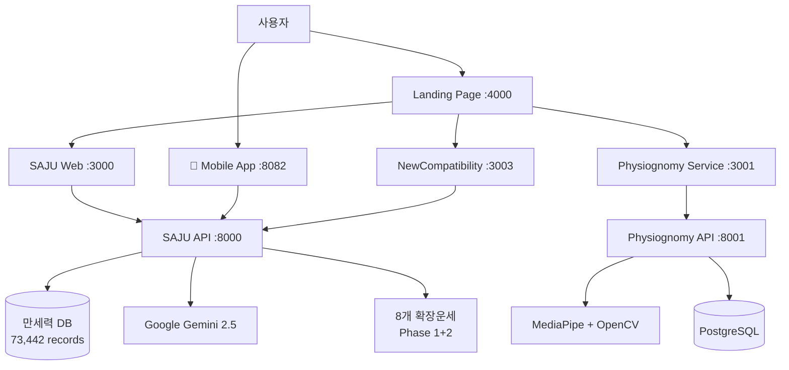

# 🔮 MSProject2 SAJU - 프로젝트 개요

> **전통 명리학 + 현대 AI 기술 융합 플랫폼**

## 📊 프로젝트 한눈에 보기

| 항목 | 내용 |
|------|------|
| **프로젝트명** | MSProject2 SAJU Platform |
| **목적** | 전통 명리학의 디지털화 및 AI 융합 |
| **완성도** | 100% (2025년 8월 완성) |
| **서비스 수** | 8개 마이크로서비스 |
| **사용자** | 일반인 + 명리학 전문가 |
| **접근 방식** | 웹 + 모바일 크로스플랫폼 |

## 🎯 프로젝트 비전

### 🌟 **Mission**
- 전통 명리학의 현대적 재해석과 대중화
- AI 기술을 통한 정확하고 접근 가능한 사주 서비스 구현

### 🚀 **Vision**
- 대한민국 최고 수준의 온라인 명리학 플랫폼
- 전통과 현대 기술의 완벽한 융합 사례

### 💡 **Core Values**
- **정확성**: 73,442개 만세력 DB 기반 정확한 분석
- **접근성**: 누구나 쉽게 이용할 수 있는 직관적 인터페이스
- **혁신성**: 최신 AI 기술과 전통 지혜의 결합

## 🏗️ 서비스 아키텍처 개요

## 🎉 완성된 8개 서비스

<table>
<tr>
<td width="50%">

### 🏠 Main Landing (:4000)
- **역할**: 통합 랜딩 허브
- **기능**: 4가지 테마, 실시간 모니터링
- **기술**: HTML + CSS + Python
- **상태**: ✅ 운영중

### 🔮 SAJU Service (:3000/:8000)
- **역할**: 사주팔자 분석 핵심 서비스
- **기능**: 37개 분석 메서드 + 8개 확장운세
- **데이터**: 73,442개 만세력 DB
- **AI**: Google Gemini 2.5-flash
- **상태**: ✅ 운영중

### 📱 Mobile App (:8082)
- **역할**: 모바일 사주 분석 앱
- **플랫폼**: iOS/Android (React Native + Expo)
- **기능**: 웹과 동등한 모든 기능
- **상태**: ✅ 운영중

### 💕 NewCompatibility (:3003/:8003)
- **역할**: AI 기반 궁합 분석
- **기능**: SAJU API 연동 궁합 + AI 채팅
- **알고리즘**: 25개 오행 상생상극 + 100개 십성 배합
- **상태**: ✅ 운영중 (2025-08-06 완성)

</td>
<td width="50%">

### 🎭 Physiognomy Service (:3001/:8001)
- **역할**: AI 관상 분석
- **기술**: MediaPipe + OpenCV
- **기능**: 468개 얼굴 랜드마크 분석
- **배포**: Docker Compose
- **상태**: ✅ 운영중

### 🔧 기타 지원 서비스
- **통합 실행 스크립트**: 원클릭 서비스 관리
- **실시간 모니터링**: 서비스 상태 추적
- **테마 시스템**: 4가지 UI 테마

</td>
</tr>
</table>

## 📈 주요 성과

### ✅ 기술적 성취
- **마이크로서비스 아키텍처** 완전 구현
- **크로스플랫폼 개발** (웹 + 모바일) 완성
- **전통 명리학 완전 디지털화** (37개 분석 메서드)
- **최신 AI 기술 융합** (Gemini, MediaPipe, React Native)

### 📊 데이터 규모
- **73,442개** 만세력 레코드 (1900-2100년)
- **37개** 사주 분석 메서드
- **8개** 확장운세 시스템
- **468개** 얼굴 랜드마크 분석

### 🏅 혁신적 특징
- **AI 대화형 해석**: 전문 용어를 쉽게 설명
- **실시간 분석**: 3초 내 빠른 결과 제공
- **개인화 서비스**: 맞춤형 질문 및 조언
- **현대적 UI/UX**: 직관적이고 세련된 인터페이스

## 🎯 타겟 사용자

### 👥 **Primary Users**
- **20-40대 직장인**: 인생 고민 및 진로 상담
- **커플/부부**: 궁합 분석 및 관계 상담
- **취업 준비생**: 적성 분석 및 직업 추천

### 👨‍💼 **Secondary Users**
- **명리학 전문가**: 전문적 분석 도구
- **상담업체**: B2B 서비스 제공
- **교육기관**: 명리학 교육 자료

## 💼 비즈니스 가치

### 🎯 **Market Positioning**
- 대한민국 최고 수준의 온라인 명리학 플랫폼
- 전통과 현대 기술의 완벽한 융합 사례
- 마이크로서비스 기반 확장 가능한 아키텍처

### 💰 **Commercial Potential**
- **프리미엄 서비스**: AI 고급 기능, 상세 분석
- **API 서비스**: 타 서비스 연동 제공
- **모바일 앱**: 앱스토어/플레이스토어 출시

### 🚀 **Scalability**
- 마이크로서비스로 무한 확장 가능
- 새로운 점술 서비스 쉽게 추가 (타로, 꿈해몽 등)
- 다국어 지원 및 해외 진출 용이

## 🔍 경쟁 우위

| 특징 | MSProject2 SAJU | 기존 서비스 |
|------|-----------------|-------------|
| **데이터 정확성** | 73,442개 검증된 만세력 | 제한적 데이터 |
| **AI 기술** | Gemini 2.5-flash 최신 AI | 구형 AI 또는 없음 |
| **서비스 범위** | 8개 통합 서비스 | 단일 서비스 |
| **플랫폼** | 웹 + 모바일 | 웹만 또는 모바일만 |
| **기술 아키텍처** | 현대적 마이크로서비스 | 모놀리식 구조 |
| **사용자 경험** | 직관적 현대적 UI | 복잡하고 구식 UI |

## 📚 다음 단계

이 개요를 읽으신 후, 다음 문서들을 참고하세요:

- **[02-quickstart](../02-quickstart/)**: 빠른 설치 및 실행 가이드
- **[03-services](../03-services/)**: 8개 서비스 상세 가이드
- **[04-api](../04-api/)**: API 문서 및 연동 가이드
- **[05-development](../05-development/)**: 개발자를 위한 상세 가이드

---

**⚠️ 본 서비스는 참고용입니다. 중요한 결정은 전문가와 상담하시기 바랍니다.**

_© 2025 MSProject2 SAJU. 전통 명리학 + 현대 AI 기술의 완벽한 융합._