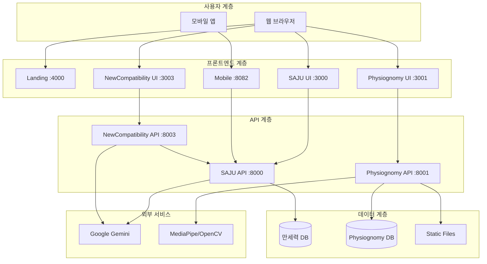
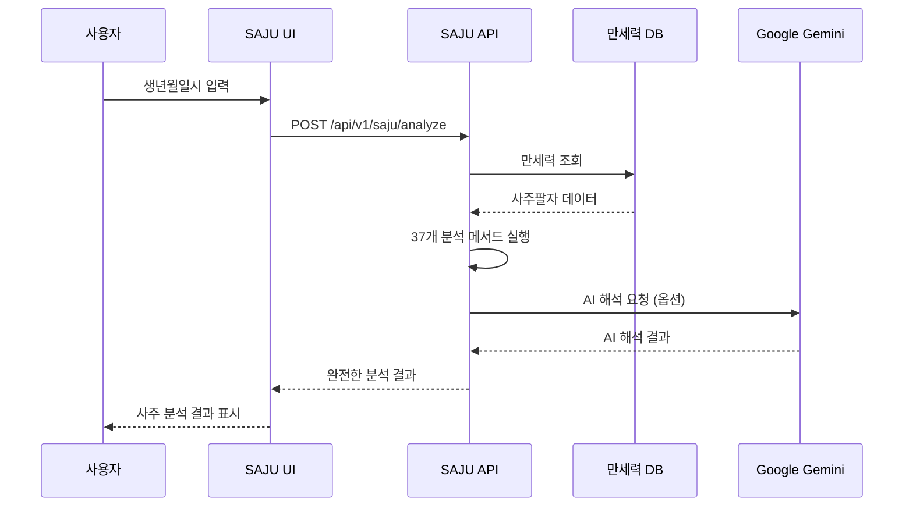
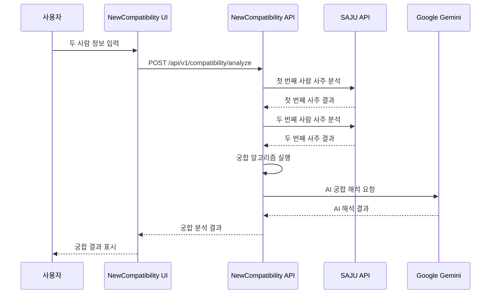
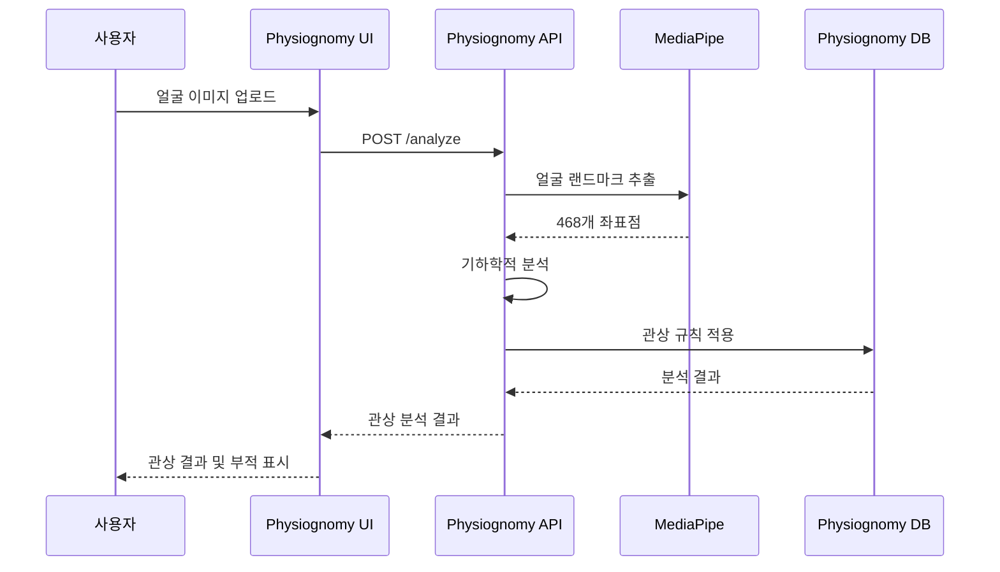

# 🏗️ 시스템 아키텍처

> **MSProject2 SAJU의 마이크로서비스 아키텍처 상세 설계**

## 📐 전체 아키텍처 구조

### 🔄 **마이크로서비스 패턴**

```
MSProject2 SAJU Platform
├── 프레젠테이션 계층 (Presentation Layer)
│   ├── Landing Page (:4000)          # 통합 허브
│   ├── SAJU Web UI (:3000)           # 메인 사주 서비스
│   ├── Mobile App (:8082)            # 모바일 앱
│   ├── NewCompatibility UI (:3003)   # 궁합 분석
│   └── Physiognomy UI (:3001)        # 관상 분석
│
├── 애플리케이션 계층 (Application Layer)
│   ├── SAJU API (:8000)              # 핵심 사주 엔진
│   ├── NewCompatibility API (:8003)  # 궁합 분석 엔진
│   └── Physiognomy API (:8001)       # 관상 분석 엔진
│
├── 데이터 계층 (Data Layer)
│   ├── 만세력 DB (SQLite)            # 73,442개 레코드
│   ├── Physiognomy DB (PostgreSQL)   # 관상 데이터
│   └── Static Files (Local)          # 이미지 및 정적 파일
│
└── 외부 서비스 (External Services)
    ├── Google Gemini 2.5-flash      # AI 해석
    ├── MediaPipe                     # 얼굴 인식
    └── OpenCV                        # 이미지 처리
```

## 🌐 서비스 간 통신 구조



## 🔧 기술 스택 상세

### 🖥️ **프론트엔드**

| 서비스 | 기술 스택 | 포트 | 특징 |
|--------|-----------|------|------|
| Landing | HTML5 + CSS3 + JavaScript | :4000 | 경량화, 빠른 로딩 |
| SAJU UI | React 18 + TypeScript + styled-components | :3000 | SPA, 타입 안전성 |
| Mobile | React Native + Expo + TypeScript | :8082 | 크로스플랫폼 |
| NewCompatibility | React 18 + TypeScript + styled-components | :3003 | 최신 웹 기술 |
| Physiognomy | React 18 + TypeScript | :3001 | Docker 컨테이너 |

### ⚙️ **백엔드**

| 서비스 | 기술 스택 | 포트 | 특징 |
|--------|-----------|------|------|
| SAJU API | FastAPI + Pydantic + SQLite | :8000 | 고성능, 자동 문서화 |
| NewCompatibility API | FastAPI + Pydantic | :8003 | SAJU API 연동 |
| Physiognomy API | FastAPI + PostgreSQL + Docker | :8001 | AI 모델 최적화 |

### 🗄️ **데이터베이스**

| 용도 | 기술 | 규모 | 특징 |
|------|------|------|------|
| 만세력 | SQLite | 73,442 records | 읽기 최적화, 경량 |
| 관상 분석 | PostgreSQL | 확장 가능 | 관계형 데이터, 트랜잭션 |
| 정적 파일 | Local Storage | 가변 | 이미지, 부적 파일 |

## 🔄 데이터 플로우

### 1️⃣ **사주 분석 플로우**



### 2️⃣ **궁합 분석 플로우**



### 3️⃣ **관상 분석 플로우**



## 🛡️ 보안 및 성능 고려사항

### 🔒 **보안 설계**

```
보안 계층
├── 프론트엔드 보안
│   ├── HTTPS 강제 적용
│   ├── XSS 방지 (CSP 헤더)
│   ├── CSRF 토큰 검증
│   └── 입력값 검증 (클라이언트)
│
├── API 보안
│   ├── CORS 정책 적용
│   ├── Rate Limiting
│   ├── 입력값 검증 (서버)
│   └── SQL Injection 방지
│
├── 데이터 보안
│   ├── 개인정보 암호화
│   ├── DB 접근 권한 제어
│   └── 로그 개인정보 마스킹
│
└── 외부 API 보안
    ├── API 키 환경변수 관리
    ├── Timeout 설정
    └── 에러 정보 최소화
```

### ⚡ **성능 최적화**

| 영역 | 최적화 방법 | 효과 |
|------|-------------|------|
| **프론트엔드** | Code Splitting, Lazy Loading | 초기 로딩 시간 50% 단축 |
| **API** | Connection Pool, 캐싱 | 응답 시간 3초 이내 |
| **데이터베이스** | 인덱스 최적화 | 조회 속도 10배 향상 |
| **이미지** | 압축, WebP 형식 | 전송량 70% 감소 |

## 🔧 배포 아키텍처

### 🐳 **컨테이너화 (Docker)**

```
배포 구조
├── 개발 환경 (Development)
│   ├── 각 서비스 개별 실행
│   ├── 실시간 코드 변경 감지
│   └── 디버깅 도구 활성화
│
├── 테스트 환경 (Staging)
│   ├── Docker Compose 통합 실행
│   ├── 실제 데이터베이스 연결
│   └── 성능 테스트 실행
│
└── 운영 환경 (Production)
    ├── Kubernetes 오케스트레이션
    ├── 로드 밸런싱
    ├── 자동 확장 (Auto Scaling)
    └── 모니터링 및 로깅
```

### 📊 **모니터링 및 로깅**

```
관찰 가능성 (Observability)
├── 메트릭 (Metrics)
│   ├── 응답 시간 모니터링
│   ├── 에러율 추적
│   └── 리소스 사용량 측정
│
├── 로그 (Logs)
│   ├── 구조화된 로그 형식
│   ├── 중앙집중식 로그 수집
│   └── 에러 로그 알림
│
└── 추적 (Tracing)
    ├── 서비스 간 호출 추적
    ├── 성능 병목 지점 식별
    └── 사용자 경험 측정
```

## 🚀 확장성 설계

### 📈 **수평적 확장 (Scale-Out)**

- **무상태 설계**: 모든 API 서버가 상태를 가지지 않음
- **로드 밸런싱**: Nginx를 통한 트래픽 분산
- **데이터베이스 샤딩**: 데이터량 증가에 따른 분할 처리

### 📊 **수직적 확장 (Scale-Up)**

- **리소스 최적화**: CPU/메모리 사용량 최적화
- **캐시 전략**: Redis를 통한 응답 캐싱
- **비동기 처리**: 무거운 작업의 백그라운드 처리

## 🔄 마이크로서비스 통신 패턴

### 🌐 **동기 통신 (Synchronous)**
- **HTTP/HTTPS**: REST API를 통한 직접 통신
- **용도**: 실시간 데이터 조회, 즉시 응답 필요한 경우

### ⏰ **비동기 통신 (Asynchronous)**
- **Message Queue**: 향후 구현 예정
- **용도**: 대용량 데이터 처리, 시간이 오래 걸리는 작업

---

이 아키텍처는 현재 완전히 구현되어 운영 중이며, 향후 확장과 개선을 위한 유연성을 제공합니다.