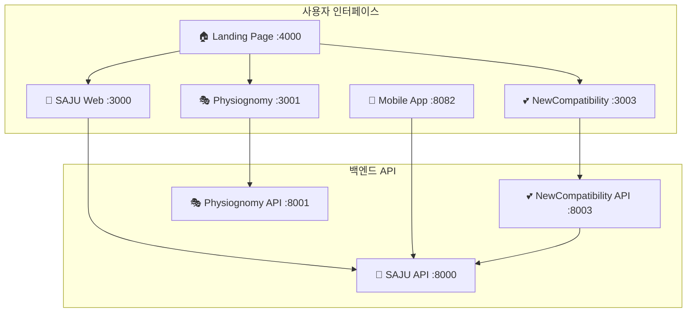
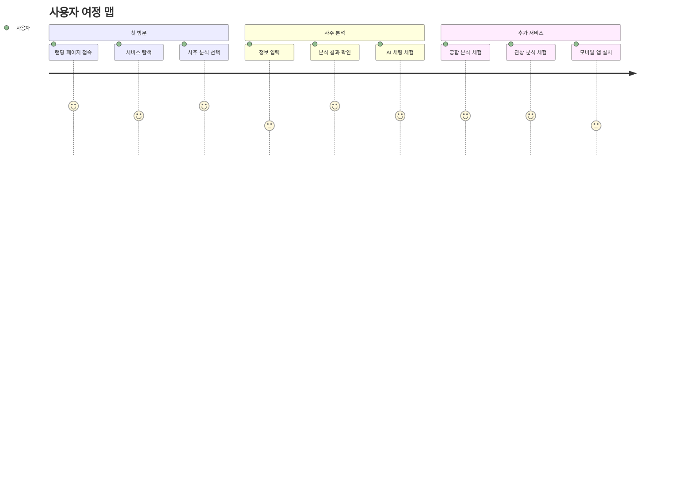

# 🎯 서비스 가이드

> **MSProject2 SAJU의 8개 마이크로서비스 완전 가이드**

## 🏗️ 서비스 아키텍처 개요

MSProject2 SAJU는 **8개의 독립적인 마이크로서비스**로 구성되어 있습니다.



## 📋 서비스 목록

| # | 서비스명 | 포트 | 상태 | 주요 기능 | 문서 |
|---|----------|------|------|-----------|------|
| 1 | **Landing Page** | :4000 | ✅ 운영중 | 통합 허브, 테마 관리 | [📖 상세보기](landing.md) |
| 2 | **SAJU Web** | :3000 | ✅ 운영중 | 메인 사주 분석 UI | [📖 상세보기](saju-web.md) |
| 3 | **SAJU API** | :8000 | ✅ 운영중 | 핵심 사주 분석 엔진 | [📖 상세보기](saju-api.md) |
| 4 | **Mobile App** | :8082 | ✅ 운영중 | 모바일 크로스플랫폼 | [📖 상세보기](mobile-app.md) |
| 5 | **NewCompatibility Web** | :3003 | ✅ 운영중 | 궁합 분석 UI | [📖 상세보기](newcompat-web.md) |
| 6 | **NewCompatibility API** | :8003 | ✅ 운영중 | 궁합 분석 엔진 | [📖 상세보기](newcompat-api.md) |
| 7 | **Physiognomy Web** | :3001 | ✅ 운영중 | 관상 분석 UI | [📖 상세보기](physiognomy-web.md) |
| 8 | **Physiognomy API** | :8001 | ✅ 운영중 | AI 관상 분석 엔진 | [📖 상세보기](physiognomy-api.md) |

## 🔥 핵심 서비스 소개

### 🏠 1. Landing Page (:4000) 
**역할**: 통합 서비스 허브
- 4가지 테마 시스템 (기본/다크/라이트/고대비)
- 실시간 서비스 상태 모니터링
- 모든 서비스 원클릭 접근
- PWA 지원으로 모바일 최적화

### 🔮 2. SAJU 서비스 (:3000/:8000)
**역할**: 핵심 사주팔자 분석 시스템
- **37개 분석 메서드**: 완전한 명리학 디지털화
- **73,442개 만세력 DB**: 1900-2100년 정확한 데이터
- **8개 확장운세**: 연애/성격/인관/재물/직업/건강/학업/가족
- **AI 대화형 해석**: Google Gemini 2.5-flash
- **대운/세운 분석**: 10년 대운 + 연간/월별 세운

### 📱 3. Mobile App (:8082)
**역할**: 크로스플랫폼 모바일 앱
- **React Native + Expo**: iOS/Android 동시 지원
- **완전 기능**: 웹 버전과 100% 동등한 기능
- **모바일 최적화 UI**: 터치 인터페이스 최적화
- **오프라인 지원**: 기본 분석 기능 오프라인 사용 가능

### 💕 4. NewCompatibility 서비스 (:3003/:8003)
**역할**: AI 기반 고급 궁합 분석
- **SAJU API 연동**: 기존 73,442개 만세력 활용
- **고급 알고리즘**: 25개 오행 상생상극 + 100개 십성 배합
- **AI 궁합 채팅**: 개인화된 궁합 상담
- **예상 질문 시스템**: AI 기반 맞춤 질문 생성

### 🎭 5. Physiognomy 서비스 (:3001/:8001)
**역할**: AI 관상 분석 및 행운의 부적
- **MediaPipe**: 468개 얼굴 랜드마크 정밀 추출
- **OpenCV**: 고급 이미지 처리 및 기하학적 분석
- **관상학 DB**: 전통 관상학 규칙 디지털화
- **행운의 부적**: AI 생성 개인 맞춤 부적
- **Docker 최적화**: 컨테이너 기반 안정적 배포

## 🌟 서비스별 주요 기능

<table>
<tr>
<td width="33%">

### 🔮 **사주 분석**
- ✅ 기본 사주팔자
- ✅ 오행 균형 분석
- ✅ 십성 분석
- ✅ 대운 분석 (8개 대운)
- ✅ 세운 분석 (연간/월별)
- ✅ 8개 확장운세
- ✅ AI 대화형 해석
- ✅ 개인화 질문 시스템

</td>
<td width="33%">

### 💕 **궁합 분석**
- ✅ 사주 기반 궁합
- ✅ 오행 상생상극
- ✅ 십성 매칭 분석
- ✅ 종합 궁합 점수
- ✅ AI 궁합 채팅
- ✅ 관계 개선 조언
- ✅ 맞춤 질문 생성
- ✅ 상세 해석 리포트

</td>
<td width="33%">

### 🎭 **관상 분석**
- ✅ 얼굴 랜드마크 추출
- ✅ 기하학적 특징 분석
- ✅ 전통 관상학 적용
- ✅ 성격 및 운세 분석
- ✅ 행운의 부적 생성
- ✅ 이미지 다운로드
- ✅ 실시간 분석
- ✅ 다양한 이미지 지원

</td>
</tr>
</table>

## 🎯 사용자 시나리오

### 👤 **일반 사용자 여정**



### 💼 **비즈니스 사용자 여정**

1. **API 문서 탐색** → API 연동 검토
2. **테스트 API 호출** → 결과 품질 확인
3. **상용 서비스 연동** → 비즈니스 통합
4. **고급 기능 활용** → AI 해석, 확장운세

## 🔧 서비스 간 연동

### 🔄 **데이터 플로우**

```
사용자 입력
    ↓
SAJU API (핵심 분석)
    ↓
┌─────────────────────┐
│   분석 결과 공유    │
├─────────────────────┤
│ • NewCompatibility  │
│ • Mobile App        │  
│ • 타 연동 시스템    │
└─────────────────────┘
```

### 🔗 **API 연동 구조**

| 호출자 | 대상 API | 목적 | 응답 |
|--------|----------|------|------|
| NewCompatibility | SAJU API | 사주 데이터 조회 | 완전한 사주 분석 |
| Mobile App | SAJU API | 모바일 사주 분석 | JSON 형태 결과 |
| Landing Page | All APIs | 상태 확인 | Health Check |
| External Service | SAJU API | 서드파티 연동 | 표준화된 응답 |

## 📊 성능 및 확장성

### ⚡ **성능 지표**

| 서비스 | 평균 응답시간 | 동시 사용자 | 처리량 |
|--------|---------------|-------------|--------|
| SAJU API | < 3초 | 100+ | 1000 req/min |
| NewCompatibility API | < 5초 | 50+ | 500 req/min |
| Physiognomy API | < 10초 | 20+ | 100 req/min |

### 🚀 **확장 가능성**

```
현재 아키텍처의 확장성
├── 수평적 확장 (Scale-Out)
│   ├── 로드 밸런서 추가
│   ├── 서버 인스턴스 증설
│   └── 데이터베이스 샤딩
│
├── 수직적 확장 (Scale-Up)
│   ├── 서버 스펙 업그레이드
│   ├── 캐시 시스템 도입
│   └── CDN 활용
│
└── 기능적 확장 (Feature-Out)
    ├── 새로운 점술 서비스
    ├── 다국어 지원
    └── 프리미엄 기능
```

## 🛡️ 보안 및 안정성

### 🔒 **보안 특징**

- **CORS 정책**: 허용된 도메인만 API 접근
- **입력 검증**: 모든 사용자 입력 검증
- **에러 처리**: 민감 정보 노출 방지
- **Rate Limiting**: API 남용 방지

### 🔄 **안정성 보장**

- **Health Check**: 모든 서비스 상태 실시간 모니터링
- **Graceful Degradation**: 일부 서비스 장애 시에도 기본 기능 유지
- **Error Boundary**: React 앱의 오류 격리 및 복구
- **Retry Logic**: 네트워크 오류 시 자동 재시도

## 📈 모니터링 및 분석

### 📊 **실시간 모니터링**

```bash
# 서비스 상태 확인
curl http://localhost:4000/health  # Landing
curl http://localhost:8000/health  # SAJU API
curl http://localhost:8003/health  # NewCompatibility API
curl http://localhost:8001/health  # Physiognomy API
```

### 📋 **로그 및 분석**

- **구조화된 로그**: JSON 형태 로그 출력
- **에러 추적**: 상세한 오류 정보 기록
- **사용 패턴 분석**: API 호출 패턴 분석
- **성능 메트릭**: 응답 시간, 처리량 측정

## 🚀 다음 단계

각 서비스에 대한 상세 정보는 다음 문서들을 참고하세요:

### 📚 **상세 가이드**
- **[SAJU 서비스 완전 가이드](saju-complete.md)** - 사주 분석의 모든 것
- **[NewCompatibility 가이드](newcompat-complete.md)** - 궁합 분석 완전 정복
- **[Physiognomy 가이드](physiognomy-complete.md)** - AI 관상 분석 가이드
- **[Mobile App 가이드](mobile-complete.md)** - 모바일 앱 사용법

### 🔗 **개발자 자료**
- **[API 문서](../04-api/)** - 모든 API 엔드포인트 상세 정보
- **[개발 가이드](../05-development/)** - 코드 수정 및 확장 가이드

---

**🎉 8개 서비스가 모두 완벽하게 작동하는 통합 플랫폼입니다!**

_각 서비스는 독립적으로 운영되면서도 서로 유기적으로 연결되어 사용자에게 최고의 경험을 제공합니다._