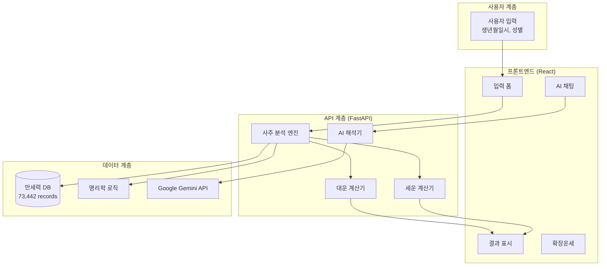

# 🔮 SAJU 서비스 완전 가이드

> **MSProject2의 핵심 서비스 - 전통 명리학의 디지털 완전체**

## 🎯 개요

SAJU 서비스는 MSProject2의 핵심으로, **73,442개의 만세력 데이터베이스**를 기반으로 한 **37개 분석 메서드**를 통해 완전한 사주팔자 분석을 제공합니다.

### 📊 **서비스 구성**
- **SAJU Web UI** (:3000) - React 18 + TypeScript 기반 사용자 인터페이스
- **SAJU API** (:8000) - FastAPI 기반 분석 엔진
- **만세력 DB** - 1900-2100년 73,442개 정확한 레코드

---

## 🏗️ 아키텍처 구조



---

## 🔥 핵심 기능

### 1️⃣ **기본 사주팔자 분석** (37개 메서드)

#### 📅 **만세력 기반 정확한 계산**
```
입력: 1990년 5월 15일 14시 (남성)
↓
만세력 조회: 73,442개 레코드에서 정확한 데이터 추출
↓
사주팔자: 경오년 신사월 경신일 계미시
```

#### 🌟 **37개 분석 메서드**

<details>
<summary><strong>📋 전체 분석 메서드 목록</strong></summary>

**기본 분석 (9개)**
1. `get_basic_info()` - 기본 사주 정보
2. `get_wuxing_balance()` - 오행 균형 분석  
3. `get_sipsung_analysis()` - 십성 분석
4. `get_heavenly_stems()` - 천간 분석
5. `get_earthly_branches()` - 지지 분석
6. `get_season_analysis()` - 계절 분석
7. `get_daymaster_strength()` - 일주 강약
8. `get_useful_god()` - 용신 분석
9. `get_taboo_god()` - 기신 분석

**성격 및 특성 분석 (8개)**
10. `get_personality_traits()` - 성격 특성
11. `get_strengths()` - 강점 분석
12. `get_weaknesses()` - 약점 분석  
13. `get_life_path()` - 인생 경로
14. `get_challenges()` - 인생 과제
15. `get_opportunities()` - 기회 요소
16. `get_life_lessons()` - 인생 교훈
17. `get_natural_talents()` - 타고난 재능

**운세 및 관계 분석 (12개)**
18. `get_career_aptitude()` - 직업 적성
19. `get_wealth_luck()` - 재물운
20. `get_health_tendencies()` - 건강 경향
21. `get_relationship_patterns()` - 인간관계 패턴
22. `get_marriage_compatibility()` - 결혼 궁합
23. `get_parenting_style()` - 자녀운 및 육아스타일
24. `get_education_luck()` - 학업운
25. `get_travel_luck()` - 여행운
26. `get_investment_advice()` - 투자 조언
27. `get_social_skills()` - 사회성 분석
28. `get_leadership_potential()` - 리더십 잠재력
29. `get_creativity_index()` - 창의력 지수

**맞춤 조언 (8개)**
30. `get_lucky_colors()` - 행운의 색상
31. `get_lucky_directions()` - 행운의 방향
32. `get_lucky_numbers()` - 행운의 숫자
33. `get_recommended_foods()` - 추천 음식
34. `get_suitable_activities()` - 적합한 활동
35. `get_lifestyle_advice()` - 라이프스타일 조언
36. `get_recommended_careers()` - 추천 직업
37. `get_health_recommendations()` - 건강 관리법

</details>

### 2️⃣ **8개 확장운세** (Phase 1+2 완성)

<table>
<tr>
<td width="50%">

**Phase 1 (4개 운세)**
- 🎯 **연애운**: 사랑과 로맨스 운세
- 👤 **성격운**: 성격 분석 및 발전 방향  
- 👥 **인관운**: 인간관계 및 사회적 관계
- 💰 **재물운**: 금전 및 재물 관련 운세

</td>
<td width="50%">

**Phase 2 (4개 운세)**  
- 💼 **직업운**: 직업 및 커리어 운세
- 💊 **건강운**: 건강 관리 및 주의사항
- 📚 **학업운**: 학습 및 교육 관련 운세
- 👪 **가족운**: 가족관계 및 가정 운세

</td>
</tr>
</table>

### 3️⃣ **대운 분석** (10년 주기)

```
대운 계산 로직
├── 기본 설정
│   ├── 남성: 양년생 - 순행, 음년생 - 역행
│   └── 여성: 양년생 - 역행, 음년생 - 순행
├── 대운 시작 나이 계산
│   └── 절기법 기반 정밀 계산
└── 8개 대운 생성 (2세~81세)
    ├── 각 10년 주기
    ├── 천간지지 조합
    └── 운세 해석
```

**대운 분석 결과 예시:**
```json
{
  "대운_리스트": [
    {
      "시작_나이": 2,
      "끝_나이": 11, 
      "대운": "임오",
      "해석": "어린 시절 활발하고 밝은 성격...",
      "주의사항": "건강 관리 필요..."
    }
    // ... 8개 대운
  ]
}
```

### 4️⃣ **세운 분석** (연간/월별)

```
세운 분석 범위
├── 연간 세운 (Annual Fortune)
│   ├── 해당 연도 전체 운세
│   ├── 월별 상세 운세 (12개월)
│   └── 주요 이벤트 예측
└── 특정 연도 분석
    ├── 사용자 지정 연도
    ├── 대운과의 상호작용  
    └── 실용적 조언
```

### 5️⃣ **AI 대화형 해석** (Google Gemini 2.5-flash)

#### 🤖 **AI 해석 특징**
- **간결하면서 친근한 톤**: 사용자 친화적 응답
- **구조화된 형식**: 핵심 결과 → 주요 특징 → 실천 조언  
- **개인화된 해석**: 사주 결과 기반 맞춤형 응답
- **200자 내외**: 적정 길이로 가독성 최적화

#### 💬 **대화 기능**
```
AI 채팅 플로우
├── 기본 질문 예시 제공
│   ├── "내 성격의 장단점은?"
│   ├── "올해 주의할 점은?"
│   └── "연애운은 어떤가요?"
├── 예상 질문 자동 생성
│   └── 사주 결과 기반 맞춤 질문
└── 자유 대화
    ├── 사용자 질문 입력
    └── AI 맞춤 응답
```

---

## 🔧 기술적 구현

### 🖥️ **프론트엔드 (React 18)**

#### 주요 컴포넌트
```typescript
// App.tsx - 메인 애플리케이션
interface SajuAnalysisResult {
  basic_info: BasicInfo;
  wuxing_balance: WuxingBalance;
  extended_fortune: ExtendedFortune;
  // ... 37개 분석 결과
}

// AIChatInterface.tsx - AI 채팅 인터페이스  
interface AIChatProps {
  analysisResult: SajuAnalysisResult;
  onQuestionSelect: (question: string) => void;
}
```

#### UI/UX 특징
- **반응형 디자인**: 모바일/태블릿/데스크톱 최적화
- **직관적 네비게이션**: 탭 기반 결과 탐색
- **실시간 피드백**: 로딩 상태 및 에러 처리
- **접근성**: ARIA 표준 준수

### ⚙️ **백엔드 (FastAPI)**

#### 핵심 서비스 클래스
```python
# services/saju_analyzer.py
class SajuAnalyzer:
    def __init__(self, db_connection):
        self.db = db_connection
        
    def analyze(self, birth_info: BirthInfo) -> SajuResult:
        """37개 메서드 통합 분석"""
        # 1. 만세력 조회
        palja = self._get_palja_from_db(birth_info)
        
        # 2. 37개 분석 메서드 실행
        results = {}
        for method in self.analysis_methods:
            results[method] = getattr(self, method)(palja)
            
        return SajuResult(**results)
```

#### API 엔드포인트
```python
@app.post("/api/v1/saju/analyze")
async def analyze_saju(birth_info: BirthInfo):
    """완전한 사주 분석"""
    
@app.post("/api/v1/saju/daeun") 
async def analyze_daeun(birth_info: BirthInfo):
    """대운 분석"""
    
@app.post("/api/v1/saju/saeun")
async def analyze_saeun(birth_info: BirthInfo, target_year: int):
    """세운 분석"""
    
@app.post("/api/v1/saju/ai-chat")
async def ai_chat(question: str, context: dict):
    """AI 대화형 해석"""
```

### 🗄️ **데이터베이스 (SQLite)**

#### 만세력 DB 구조
```sql
CREATE TABLE manseryuk (
    id INTEGER PRIMARY KEY,
    year INTEGER NOT NULL,        -- 년도 (1900-2100)
    month INTEGER NOT NULL,       -- 월 (1-12) 
    day INTEGER NOT NULL,         -- 일 (1-31)
    hour INTEGER NOT NULL,        -- 시간 (0-23)
    year_stem VARCHAR(2),         -- 년간
    year_branch VARCHAR(2),       -- 년지
    month_stem VARCHAR(2),        -- 월간
    month_branch VARCHAR(2),      -- 월지
    day_stem VARCHAR(2),          -- 일간  
    day_branch VARCHAR(2),        -- 일지
    hour_stem VARCHAR(2),         -- 시간
    hour_branch VARCHAR(2),       -- 시지
    season VARCHAR(10),           -- 계절
    created_at DATETIME DEFAULT CURRENT_TIMESTAMP
);

-- 인덱스 최적화
CREATE INDEX idx_date ON manseryuk(year, month, day, hour);
CREATE INDEX idx_stems ON manseryuk(day_stem, day_branch);
```

#### 데이터 통계
- **총 레코드 수**: 73,442개
- **기간**: 1900년 1월 1일 ~ 2100년 12월 31일
- **시간 단위**: 2시간 간격 (12지지 시간)
- **정확도**: 고영창님 "진짜 만세력" 기반 검증

---

## 📊 사용 예시

### 🎯 **기본 사주 분석**

**입력:**
```json
{
  "year": 1990,
  "month": 5, 
  "day": 15,
  "hour": 14,
  "gender": "male",
  "name": "홍길동"
}
```

**출력 (요약):**
```json
{
  "basic_info": {
    "사주팔자": "경오년 신사월 경신일 계미시",
    "일주": "경신",
    "계절": "늦봄"
  },
  "wuxing_balance": {
    "오행_점수": {"금": 3, "목": 1, "수": 2, "화": 2, "토": 2},
    "균형_점수": 89.6,
    "성격_유형": "성장형"
  },
  "extended_fortune": {
    "연애운": {"점수": 85, "해석": "올해 하반기 좋은 인연..."},
    "재물운": {"점수": 78, "해석": "투자보다는 저축 중심..."}
    // ... 8개 확장운세
  }
}
```

### 🤖 **AI 채팅 예시**

**질문**: "내 성격의 장단점을 알려주세요"

**AI 응답**:
```
## 핵심 결과 ✨
경신일주님은 차분하면서도 추진력 있는 성격이시네요!

## 주요 특징 😊
- 강점: 책임감이 강하고 신중한 판단력을 가지고 계세요
- 약점: 때로는 완벽주의 경향으로 스트레스를 받을 수 있어요
- 특징: 금의 성질로 정의감이 뚜렷하고 원칙을 중시해요

## 실천 조언 💪
- 가끔은 완벽함을 놓고 여유를 가져보세요
- 타인의 의견도 열린 마음으로 들어보시면 좋겠어요

더 궁금한 점이 있으시면 언제든 물어보세요! 😊
```

### 📈 **대운 분석 예시**

```json
{
  "대운_개요": {
    "대운_시작_나이": 2,
    "현재_대운": "기사 (32-41세)",
    "다음_대운": "무진 (42-51세)"
  },
  "현재_대운_해석": {
    "주요_특징": "창의적이고 활동적인 시기",
    "기회_요소": "새로운 도전과 변화의 시기",
    "주의사항": "성급한 결정보다는 신중한 계획 필요"
  }
}
```

---

## 🎯 사용자 가이드

### 📝 **Step 1: 정보 입력**

1. **[localhost:3000](http://localhost:3000)** 접속
2. 정확한 생년월일시 입력 (양력 기준)
3. 성별 선택
4. 이름 입력 (선택사항)

**⚠️ 입력 시 주의사항:**
- 반드시 **양력** 날짜 사용
- **정확한 시간** 입력 (2시간 차이로 시주가 바뀜)
- **출생지는 현재 미반영** (향후 업데이트 예정)

### 📊 **Step 2: 결과 탐색**

#### 탭별 구성
1. **기본 분석**: 사주팔자, 오행, 십성
2. **성격 분석**: 강점, 약점, 특성
3. **운세 분석**: 8개 확장운세  
4. **대운 분석**: 10년 주기 인생 운세
5. **세운 분석**: 올해/내년 상세 운세

### 🤖 **Step 3: AI 채팅**

1. **"AI와 대화하기"** 버튼 클릭
2. **예상 질문 선택** 또는 **직접 질문 입력**
3. AI와 자유로운 대화로 상세 해석 확인

### 📱 **Step 4: 모바일 앱 연동**

동일한 기능을 모바일에서도 사용 가능:
- **iOS/Android**: Expo Go 앱으로 접근
- **PWA**: 브라우저에서 "홈 화면에 추가"

---

## 🔧 개발자 정보

### 🛠️ **로컬 개발 환경**

```bash
# 백엔드 개발 서버 실행
cd SAJU/backend
pip install -r requirements.txt
uvicorn app.main:app --reload --port 8000

# 프론트엔드 개발 서버 실행  
cd SAJU/frontend
npm install
npm start

# 데이터베이스 확인
sqlite3 SAJU/manseryukDB/DB/manseryuk.db
.schema manseryuk
SELECT COUNT(*) FROM manseryuk;  -- 73442 should return
```

### 🧪 **API 테스트**

```bash
# Health Check
curl http://localhost:8000/health

# 기본 분석 테스트
curl -X POST "http://localhost:8000/api/v1/saju/analyze" \
-H "Content-Type: application/json" \
-d '{
  "year": 1990,
  "month": 5,
  "day": 15, 
  "hour": 14,
  "gender": "male",
  "name": "테스트"
}'

# 대운 분석 테스트
curl -X POST "http://localhost:8000/api/v1/saju/daeun" \
-H "Content-Type: application/json" \
-d '{
  "year": 1990,
  "month": 5,
  "day": 15,
  "hour": 14,
  "gender": "male"
}'
```

### 📈 **성능 최적화**

- **DB 인덱스**: 날짜 및 간지 조회 최적화
- **응답 캐싱**: 동일 입력에 대한 결과 캐싱
- **비동기 처리**: AI API 호출 비동기 처리
- **에러 처리**: Graceful degradation 구현

---

## 🚀 향후 계획

### 📅 **단기 계획 (1-3개월)**
- **출생지 고려**: 지역별 시차 적용
- **음력 변환**: 음력 입력 지원
- **상세 해석 확장**: 더 풍부한 해석 내용

### 🎯 **중기 계획 (6개월)**
- **개인화 학습**: 사용자별 맞춤 해석
- **프리미엄 기능**: 고급 분석 및 리포트
- **다국어 지원**: 영어, 중국어 번역

### 🌟 **장기 계획 (1년+)**
- **AI 모델 자체 훈련**: 명리학 전용 AI 모델
- **실시간 운세 업데이트**: 매일 운세 변화
- **소셜 기능**: 사주 공유 및 커뮤니티

---

**🎉 SAJU 서비스는 전통 명리학의 디지털 완전체입니다!**

_73,442개의 정확한 만세력과 37개의 분석 메서드, 그리고 최신 AI 기술이 만나 사용자에게 최고의 사주 분석 경험을 제공합니다._